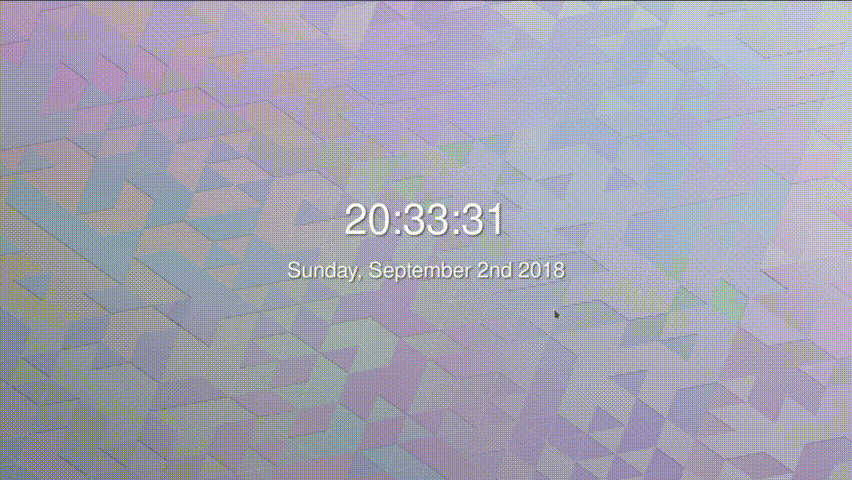
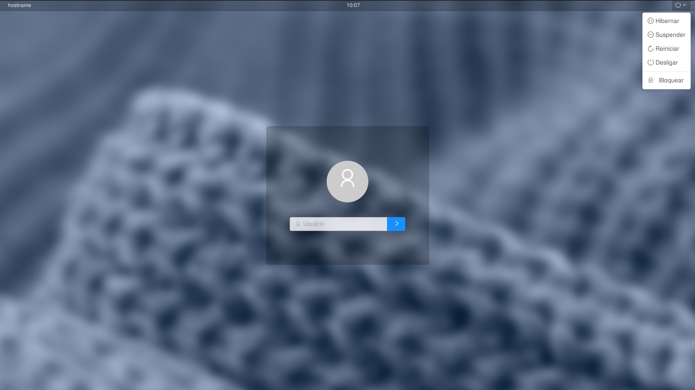
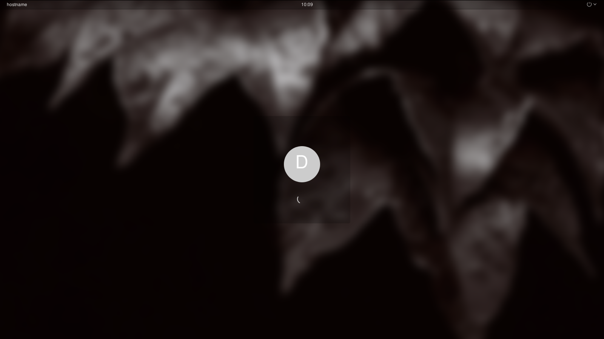

# Iskra
###### ( iskra-webkit-greeter )
<p align="center">
  
</p>

A beautiful, awesome themed login screen written on lightdm and the lightdm-webkit2-greeter.

Iskra, (from russian: И́скра, translated: spark) was the name of a political newspaper founded by Vladmir Lenin in 1900. _Iskra's_ motto was "From a spark a fire will flare up". The editorial line championed the battle for political freedom as well as the cause of socialist revolution.

**Try it out [here, at the LIVE DEMO](https://felipemarinho97.github.io/iskra-webkit-greeter/demo).**



## Features

- A beautiful Lockscreen slider
- Username promt (no userlist)
- Uses updated [JavaScript API](https://doclets.io/Antergos/web-greeter/stable) of [Web Greeter for LightDM](https://github.com/Antergos/web-greeter)
- Shows the hostname
- Reboot, Poweroff, Suspend and Hibernation if avaliable
- Pick a random wallpaper from `img/wallpapers` folder

## Screenshots




## Prerequisites

- `lightdm`
- `lightdm-webkit2-greeter`

Installation packages of `lightdm-webkit2-greeter` for Ubuntu, Arch (and other distros) can be found [here](https://github.com/Antergos/web-greeter).

## Installation

Clone the theme to `/usr/share/lightdm-webkit/themes/iskra-webkit-greeter`:

```sh
cd /usr/share/lightdm-webkit/themes
git clone https://github.com/felipemarinho97/iskra-webkit-greeter.git iskra-webkit-greeter
```

To select **iskra** as default theme just change the `webkit-theme` property in `/etc/lightdm/lightdm-webkit2-greeeter.conf` to `iskra-webkit-greeter`

## Wallpapers

To add more background wallpapers, copy the `jpg` files to `img/wallpapers`.

## Uninstallation

To uninstall, simply restore the `greeter-session` property of the `/etc/lightdm/lightdm.conf` file and restart your computer (or at least lightdm).

You may also want to:

- Remove the folder `iskra-webkit-greeter` which was created in `/usr/share/lightdm-webkit/themes/`
- Restore the `webkit-theme` property of the `/etc/lightdm/lightdm-webkit-greeter.conf` file

## Author

Felipe Marinho – [felipevm97@gmail.com]()

If you have any suggestions please fell free to contact-me.

## Contributing

1. Fork it (<https://github.com/FelipeMarinho97/iskra-webkit-greeter/fork>)
2. Create your feature branch (`git checkout -b feature/fooBar`)
3. Commit your changes (`git commit -am 'Add some fooBar'`)
4. Push to the branch (`git push origin feature/fooBar`)
5. Create a new Pull Request
